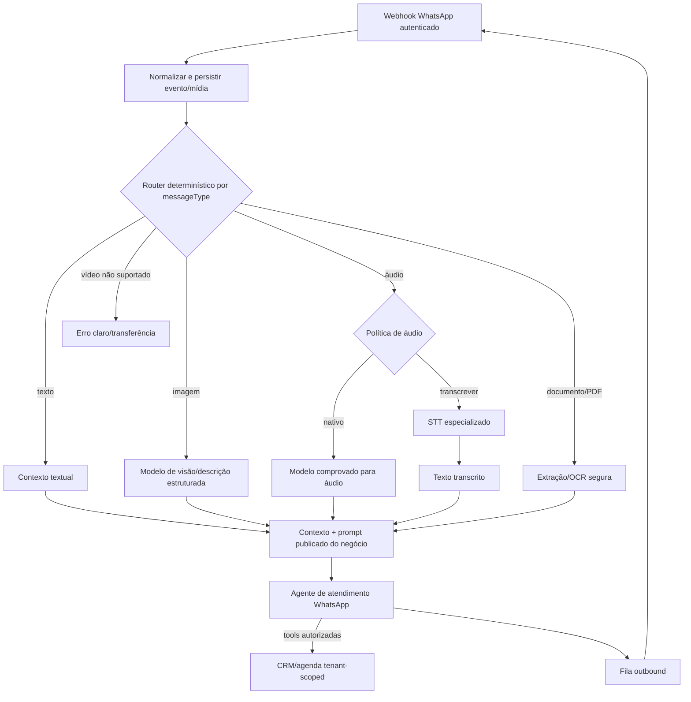

# Auditoria de IA, Console Administrativo e Core do Workspace

**Data:** 2026-09-27
**Escopo:** inventário do código atual, responsabilidades dos modelos/agentes, roteamento multimodal, segredos, consumo, redesenho do console administrativo e entrega faseada do core pós-login.
**Status:** auditoria documental concluída; próxima etapa é execução incremental. Esta rodada **não altera código nem desativa rotas**.

> Este documento registra a direção mais recente do produto. Ele complementa o histórico dos demais handoffs e planos; para as próximas entregas, suas prioridades e decisões são a referência.

## 1. Decisão executiva

A plataforma não deve ter um “agente” genérico tentando fazer tudo. É necessário separar **provedores/modelos**, **agentes com objetivo e permissões próprios** e **roteadores determinísticos de fluxo**. O encaminhamento de mídia deve começar como lógica previsível da aplicação, não depender de decisão livre de modelo nem de um n8n.

A primeira entrega de produto após o login será uma única área operacional clara, chamada **Instância e consumo** (título: **Conexão da instância e consumo**). Ela mostrará somente:

1. estado e configuração operacional da instância WhatsApp, conexão/QR, número, última atualização e recuperação de falhas;
2. consumo/cotas do workspace, com período, usados, limite e saldo restante.

Até essa fatia ser validada, o produto deve **esconder da navegação e bloquear a abertura normal das demais áreas atrás de uma feature flag reversível**, mantendo código, dados e APIs preservados. Isso é contenção da interface — **não apagar módulos, tabelas nem desligar workers, mensagens ou dados funcionais às cegas**. Para novas contas ou ambiente do core, o agente automático só é habilitado depois que conexão, inbound e resposta manual passarem pelos gates definidos aqui.

Em paralelo, o Console Administrativo da Plataforma será redesenhado como área interna independente, com navegação responsiva inspirada no shell do workspace. Será o lugar central para configurar provedores/modelos e governar agentes; o painel do cliente não deve virar uma tela de infraestrutura.

## 2. Como a solução está organizada hoje

### 2.1 Componentes existentes

| Componente | O que é hoje | Onde aparece/roda | O que não é |
|---|---|---|---|
| **Agente nativo de atendimento** | Runtime de conversa com contexto, system prompt, loop de tools e envio outbound; reage a `message.received` no worker. | `server/native-agent.ts`, acionado pelo processamento de eventos em `server/db.ts`. | Não é o modelo, o provedor nem o roteador do WhatsApp. |
| **Roteamento por capacidade** | Código que seleciona `text`, `vision`, `audio` ou `document` por `messageType`. | `capabilityForMessageType()` em `server/llm-providers.ts`. | Não é um agente e atualmente não é um fluxo n8n. |
| **Provedores/modelos** | Endpoints compatíveis com Chat Completions, catalogados como NVIDIA NIM, Google Gemini e OpenAI-compatible; rotas por capacidade. | Política global em `/platform-admin/ai`; configurações podem ser lidas de `workspaceSettings`. | Não são agentes independentes. Um ID de modelo não define objetivo nem permissão. |
| **IA de estruturação do onboarding** | Extrai fatos para JSON de um bloco, reporta ausências/conflitos/confiança e salva proposta como rascunho. Usa `invokeLLM`, consentimento e telemetria de tokens/modelo. | `server/onboarding-structured.ts` e `onboarding.extractProposal` em `server/routers.ts`. | Não é o agente do WhatsApp nem um chat de suporte ao usuário. |
| **Transcrição de onboarding (STT)** | Baixa o áudio e chama `v1/audio/transcriptions` com `whisper-1`, usando URL/chave do serviço interno no ambiente. | `server/_core/voiceTranscription.ts` e rotas de áudio do onboarding. | Não é o roteador do áudio do WhatsApp. |
| **Ajuda dentro do Forte Panel** | Não há um chat de ajuda completo conectado a uma base de conhecimento. `AIChatBox` é componente genérico/exemplo, sem backend de suporte conectado. | `client/src/components/AIChatBox.tsx` e showcase. | Não deve ser confundido com o atendimento WhatsApp. |
| **Copiloto de configuração/admin** | Não foi encontrado como agente dedicado. Há telas de política e configuração de IA, mas não um operador conversacional admin com ferramentas e permissões próprias. | Futuro módulo interno do Console Administrativo. | Não deve compartilhar tools do atendimento do cliente por padrão. |

Os papéis `owner`, `admin`, `manager` e `agent` do workspace são **papéis humanos/permissões de membro**, não tipos de agente de IA. Já `platform_admin`, `platform_support_readonly` e `platform_support_operator` são permissões administrativas da plataforma, independentes do tenant.

### 2.2 Caminho atual de mensagem do WhatsApp

```text
Baileys/gateway
  → webhook assinado e ingestão/idempotência
  → mensagem, contato/conversa e evento persistidos
  → worker consome a cota técnica aiRequests
  → verifica se a configuração do agente está habilitada
  → runNativeAgent carrega contato, histórico, prompt e mídia
  → capabilityForMessageType seleciona a rota de modelo
  → loop de inferência e tools do agente
  → outbound enfileirado e enviado pelo provider/instância de origem
```

O roteamento observado é:

| `messageType` | Capacidade selecionada | Payload para o runtime atual | Observação |
|---|---|---|---|
| `text` e tipos não mapeados | `text` | Texto/contexto | Rota padrão. |
| `image` | `vision` | Texto + `image_url` quando há mídia resolvida. | Não há etapa separada de OCR no caminho do agente. |
| `audio` | `audio` | Texto + `file_url` quando há mídia resolvida. | Envia áudio diretamente ao endpoint/modelo de chat multimodal; não chama `transcribeAudio`. |
| `document`/`pdf` | `document` | Texto + `file_url`. | Depende de compatibilidade do endpoint com o formato enviado. |
| `video` | **`text`** | O construtor também pode usar `file_url`. | Inconsistência: mídia pode ser enviada por uma rota de texto. |

A hipótese “WhatsApp recebe áudio → usa um modelo de áudio → responde” descreve aproximadamente o código, mas há uma nuance: **o mesmo agente e seu loop de tools usam a rota selecionada para aquela capacidade durante a inferência**. Não há hoje um estágio explícito “transcrever/interpretar mídia” seguido obrigatoriamente de um agente de resposta em texto. Não há fallback automático comprovado para STT quando um endpoint de áudio falha.

O worker incrementa `aiRequests` antes de carregar/verificar se a configuração do agente está desativada. Isso mede eventos/tentativas cobertos pela cota técnica, não chamadas bem-sucedidas nem tokens. A resposta final é enfileirada com metadados do agente/modelo retornado.

### 2.3 Fluxo atual do onboarding por áudio/texto

```text
resposta de texto ou áudio
  → consentimento por finalidade
  → áudio privado/retido conforme política
  → STT Whisper por URL/chave do ambiente (somente se áudio)
  → texto revisto pelo usuário
  → invokeLLM extrai JSON para schema do bloco
  → proposta persistida como draft + missing/conflicts/confidence
  → telemetria registra modelo e tokens do extrator
  → confirmação humana antes da publicação
```

Esse fluxo já separa transcrição de estruturação e é uma boa referência de responsabilidades. A extração retorna contagem de tokens para telemetria do onboarding, mas isso **não significa** que o consumo do agente WhatsApp esteja sendo medido em tokens.

## 3. Papéis conceituais e agentes que devemos reconhecer

### 3.1 Conceitos

- **Provider/conexão:** URL base, autenticação, contrato, timeout e capacidades suportadas.
- **Modelo:** identificador fornecido pelo provider; pode suportar texto, visão, áudio ou modalidade multimodal.
- **Rota/capacidade:** regra determinística que escolhe provider/modelo e eventual preprocessing da entrada.
- **Agente:** runtime nomeado, com finalidade, prompt/política, contexto, ferramentas permitidas, limites e versão.
- **Tool:** ação de backend com contrato e autorização próprios; não é um agente nem um modelo.
- **Orquestrador do evento:** código que valida/persiste, escolhe um pipeline e registra status; não precisa ser LLM/n8n.

### 3.2 Catálogo proposto

| Agente | Finalidade | Dados/fontes permitidos | Tools/efeitos | Estado |
|---|---|---|---|---|
| **Atendimento WhatsApp do negócio** | Responder clientes com base no prompt publicado e nos dados daquele tenant. | Mensagem, mídia normalizada, histórico e registros operacionais autorizados. | Tools operacionais existentes: lead, nota, agenda e transferência humana, sempre tenant-scoped e idempotentes. | Existe como `runNativeAgent`; precisa de roteamento e telemetria mais claros. |
| **Configurador do negócio (onboarding)** | Transformar respostas em rascunhos de fatos/regras, com revisão e publicação humana. | Respostas/transcrições e dados do workspace dono, com origem e consentimento. | Extrair, validar, propor pergunta e apontar lacunas; sem publicar sozinho. | STT e extração estruturada existem; onboarding progressivo completo é roadmap. |
| **Ajuda do Forte Panel** | Explicar navegação, permissões e uso do produto ao usuário logado. | Documentação aprovada e contexto mínimo da versão/tela. | Pesquisa de documentação e links internos; leitura apenas. | Ainda não existe como serviço conectado. |
| **Copiloto administrativo** | Ajudar operador a diagnosticar configuração e propor alterações. | Documentação técnica, status e dados escopados pela permissão/sessão. | Começar read-only e produzir rascunhos; alterações exigem ação humana explícita e auditada. | Ainda não existe como agente dedicado. |

Não criar um agente por provider/modelo, nem conceder ao configurador/admin tools financeiras ou de envio do agente WhatsApp. Um mesmo provider pode atender vários papéis, mas cada agente conserva **prompt, contexto, ferramentas, permissões, métricas e ciclo de publicação isolados**.

## 4. Achados e riscos do código atual

1. **Fonte ambígua para o modelo.** O runtime passa `config.model`, mas `invokeConfiguredLLM` prefere `routing[capability].model`. O campo “modelo lógico padrão” pode não controlar a chamada. Definir fonte única e mostrar modelo efetivo por rota.
2. **Herança global/local superficial.** `readStoredNativeAgentConfig()` faz merge superficial entre configuração global e de workspace. Se houver `workspaceStored.llm`, o objeto multimodelo local pode substituir o global inteiro, não somente as rotas alteradas. Além disso, `enabled` local pode prevalecer sobre política global; pausar global não é garantidamente kill switch para workspace que manteve `enabled: true`. Definir precedência por campo e testar todas as combinações.
3. **Tela e permissão não refletem configuração de cliente.** `/ai-config` usa `PlatformOnlyGuard`; `agent.config/save/testConnection` requer administrador de plataforma. Essa tela não é acessível ao owner normal nem fica na navegação comum. A configuração global existe em `/platform-admin/ai`, mas não há um inventário único de herança/efetividade.
4. **Rótulo de áudio impreciso.** A capacidade global `audio` é chamada “Transcrição de áudio”, embora o agente WhatsApp envie o arquivo ao endpoint de chat multimodal. STT do onboarding é outra integração e outra rota.
5. **Rota de vídeo ausente.** `video` pode virar `file_url`, mas cai em `text`. Bloquear explicitamente até criar uma capability e testes próprios.
6. **Contrato do provider é pressuposto.** O cliente usa `/chat/completions`, `Bearer` e `max_tokens`; endpoints que exigem outro contrato podem falhar. A normalização acrescenta `/v1` quando a base não termina exatamente nesse sufixo. Validar bases com prefixos próprios, inclusive a URL padrão configurada para Gemini, antes de considerá-las funcionais.
7. **Teste não valida modalidade.** O teste de conexão envia “OK” textual até para `vision`, `audio` ou `document`; prova uma resposta textual, não que o endpoint interprete imagem/áudio/PDF. Separar resultado de conectividade de validação multimodal.
8. **Consumo não é custo/token.** `workspaceUsageBuckets` e buckets de usuário contam `apiRequests`, `aiRequests` e `outboundMessages` por janela de um minuto para quota/rate limit. A tela mostra essa janela e limites por plano; não é custo por provider nem histórico mensal. Instrumentar separadamente antes de usar a palavra “gasto”.
9. **Proveniência da configuração confusa.** `NativeAgentConfig.apiSource` é declarado como `environment`, embora providers/chaves também possam vir de `workspaceSettings`. A interface precisa indicar “global”, “override do workspace” ou “ambiente”.
10. **Credenciais fragmentadas.** A configuração de provider do agente fica em `native_agent_config` no workspace; a política global em `platform_native_agent_config` numa configuração especial com ID `0`; STT e LLM utilitário usam `ENV.forgeApiUrl`/`ENV.forgeApiKey`. Não há um cadastro único de credenciais.
11. **Criptografia acoplada ao JWT secret.** `encryptProviderSecret` deriva AES-256-GCM de `JWT_SECRET`. Troca/rotação sem migração torna os segredos existentes ilegíveis. Separar a chave de criptografia de providers (KMS/secret manager ou chave própria) e planejar rotação antes de ampliar o uso.
12. **Catálogo de modelos limitado.** Há três IDs estáticos e campos manuais para modelo/URL. `agent.models` lista modelos do serviço interno, não um inventário garantido dos endpoints configurados. Distinguir catálogo carregado, ID manual e capability realmente testada.
13. **Ajuda de IA não está implementada.** `AIChatBox` é somente componente genérico; não há retrieval/base de conhecimento nem perfil de permissões conectado.

Os itens 2, 6, 7 e 11 são gates de backend/segurança antes de dar ao console controle operacional amplo. Os demais orientam UX, taxonomia e métricas.

## 5. Política de configuração e localização das chaves

### 5.1 Quem configura o quê

| Dado | Local recomendado | Exibição | Regra |
|---|---|---|---|
| Provider LLM: nome, URL, contrato e capabilities | Console Administrativo → **IA e modelos** | URL e metadados visíveis; chave nunca em claro após salvar. | Centralizar para operação gerenciada; auditar criação, teste, ativação e troca. |
| API key de provider LLM | Campo secreto do provider no console; cifrada no servidor | Somente status, data de alteração e sufixo mascarado. | Salvar substituindo o valor; input vazio/mascarado preserva; limpar exige confirmação. |
| Modelo por capability/fallback | Console Admin → **Rotas e capacidades** | Visível | Validar provider e modalidade; fallback explícito, nunca silencioso. |
| Override por workspace (se BYOK for permitido) | Detalhe do workspace → **IA efetiva**, com sessão/permissão apropriada | Somente metadados e segredo mascarado | Definir primeiro modelo de negócio, precedência, isolamento e auditoria. Não implantar antes disso. |
| Prompt do agente de negócio | Configuração de agente/negócio com preview e versionamento | Visível ao workspace dono | Nunca colocar chave/secret no prompt; separar política global e regras do negócio. |
| Secrets de infraestrutura (`JWT_SECRET`, signing keys, credenciais DB/Redis e secrets do gateway) | Secret manager/ambiente de deploy | Apenas status/saúde | Não transformar secret operacional em campo editável do cliente. |
| STT interno | Futuro provider/capability separado em IA e modelos | Chave mascarada | Até migração, manter environment-only e dizer “gerenciado pelo servidor”; não prometer que a UI atual controla STT WhatsApp. |
| Segredos de sessão WhatsApp/tokens Meta/PAPI | Provisionamento do canal/gateway | Nunca valor bruto | Cliente pareia o número; não precisa receber credencial de infraestrutura. |

**Nunca gravar valores reais de chaves/tokens em Markdown, Git, prompts, logs, telemetria ou query strings.**

### 5.2 Tela de configuração proposta

1. **Conexões/providers:** nome, URL, tipo de contrato/adapter, secret cifrado, estado, timeout e teste de conexão.
2. **Modelos:** ID, provider, capabilities declaradas, limites conhecidos, fonte do catálogo ou marcação manual, data e validação por modalidade.
3. **Rotas:** texto, visão, áudio nativo, áudio `STT → texto`, documentos; vídeo somente quando implementado. Mostrar provider/modelo efetivo, primário/fallback explícito, limite e comportamento de falha.
4. **Testes isolados:** texto para texto; fixture de imagem para visão; arquivo consentido/de teste para STT/áudio; PDF de fixture para documento. Teste nunca envia WhatsApp real.
5. **Publicação/versionamento:** draft, diff, motivo, autor, teste aprovado, publicar e rollback como nova versão imutável.

## 6. Fluxo multimodal recomendado

O conceito do switch do n8n é válido como **roteador por tipo de entrada**, mas deve começar como função determinística/event router no backend e aproveitar a fila/worker existentes. Adotar n8n só se surgir um requisito real que não se resolva com essa base.



Regras:

- Rota e modalidade são decididas pelo backend, não por resposta livre de modelo.
- **Áudio:** dois modos configuráveis e claros: `native_audio` entrega mídia a modelo validado; `stt_then_text` transcreve e passa texto ao agente textual. O segundo facilita tool-calling/auditoria, mas adiciona custo e latência STT + LLM. Escolher conscientemente; não enviar/transcrever duas vezes sem necessidade.
- **Imagem/documento:** pré-processador pode extrair descrição/texto; o agente usa o prompt de negócio para responder. Controlar OCR, limites, confiança, URL assinada e retenção.
- **Vídeo:** desabilitado até pipeline, mime, capability e testes próprios existirem.
- Falha de branch: registrar status, oferecer mensagem segura/transferência quando apropriado e permitir retry idempotente. Sem resposta inventada ou troca de provider/custo silenciosa.
- Uma resposta final por evento idempotente. Tools com efeitos mantêm claim/fingerprint e validação de workspace.

## 7. Redesenho do Console Administrativo

### 7.1 Direção visual e interação

Usar o **mesmo sistema visual do workspace** — tokens de cor, cards, status, tipografia e linguagem — sem copiar os módulos de cliente. `PanelLayout` já tem sidebar recolhível, drawer móvel, header, identificação de contexto e logout. `PlatformShell` já tem marca, navegação e header, mas não compartilha o shell e usa nav horizontal em mobile. O redesign deve harmonizar os dois e melhorar navegação em viewport estreita.

Padrão desejado:

- Sidebar desktop recolhível, grupos, estado ativo pelo pathname e `aria-current`.
- Drawer mobile com botão menu, backdrop, foco, Escape e retorno de foco; não depender de uma barra horizontal para navegar no admin.
- Header com breadcrumb/área, título, descrição, status do ambiente, busca/ação contextual e menu/logout do operador.
- Páginas independentes, sem formulário monolítico; query/tab na URL e back/forward previsíveis.
- Foco visível, alvos de toque adequados, contraste, estados loading/vazio/erro acionáveis e confirmações que expliquem o efeito. Tabelas adaptadas para mobile.
- Preservar o visual escuro/verde com hierarquia, espaçamento e respiro do workspace. Diferenciar “Console da Plataforma” de “Workspace cliente” por badge/contexto, não por layout estranho.

### 7.2 Mapa proposto de páginas

| Área | Conteúdo principal |
|---|---|
| **Visão geral** | Saúde de API, filas/worker, gateway e providers; alertas acionáveis, falhas recentes e KPIs com fonte/janela. Sem duplicar todo o formulário de IA global. |
| **Instâncias e canais** | Inventário por workspace/provider, estado real da sessão versus gateway, última atividade, falhas e ações auditadas; QR somente no fluxo autorizado. |
| **IA e modelos** | Providers/conexões, catálogo, credenciais cifradas, capabilities, rotas, testes multimodais, timeout/fallback e histórico. |
| **Agentes** | Catálogo por finalidade, estado, prompt/política, tools, contexto, limites, fallback humano, simulação, aprovação e versões. |
| **Workspaces** | Busca/paginação, owner, plano/status, canal, saúde, uso (unidade/janela) e agentes ativos; detalhe em páginas/abas próprias. |
| **Suporte** | Fila/tickets e sessões read-only/operator com workspace, motivo, expiração, escopo e revogação; copiloto IA futuro começa read-only. |
| **Auditoria** | Alterações de provider/rota, modelo efetivo, prompts/publicações, testes, suporte e ações; ator, motivo/request ID, sem armazenar chave bruta. |
| **Ajuda/conhecimento** | Documentação versionada do Forte Panel, busca e status da base usada pelo assistente; separada dos prompts de negócio. |

Cada página carrega dados sob demanda e aplica autorização no backend. Esconder uma aba não substitui a permissão: feature flag controla disponibilidade gradual, não segurança.

### 7.3 Detalhe de workspace

- **Resumo:** identidade, owner, estado, plano, saúde e atividade.
- **Instância:** provider/estado, número mascarado, gateway e erros; segredo nunca em claro.
- **Uso:** janela/limites por plano; tokens e custo somente se instrumentados.
- **IA efetiva:** origem global/override, provider/modelo por capability, configuração incompleta e testes.
- **Agente:** enabled, prompt draft/publicado, versão, tools liberadas, limites e simulação.
- **Suporte/auditoria:** sessões e alterações escopadas.

## 8. Core pós-login e congelamento faseado

### 8.1 Página inicial e navegação temporária

- Redirecionar `/` pós-login para uma rota canônica, indicativamente **`/instance-usage`**, alinhada depois ao padrão do projeto. Título visível: **“Conexão da instância e consumo”**; item da sidebar: **“Instância e consumo”**.
- Com `CORE_ONLY_MODE` ativo, mostrar uma entrada principal. Perfil/logout permanecem no header. Dashboard, Inbox, Kanban, Agenda, CRM, Financeiro, Equipe, Preferências, IA e integrações gerais ficam fora da navegação até reabertura.
- A página contém somente o card/wizard da instância e o painel de consumo. Não misturar provider LLM, prompt, console interno ou dados de outros módulos.
- Rotas antigas são redirecionadas ao core com mensagem “área em reabertura gradual” ou página temporariamente indisponível. Preservar código, dados e deep links para reativação controlada.
- Controlar modo por flag central/versionada, com bypass apenas para operadores autorizados; não espalhar booleans hardcoded pelas páginas.
- Diferenciar **gateway saudável**, **instância pareada**, **webhook/inbound validado** e **envio outbound validado**. Conectar WhatsApp não significa agente pronto. Cliente pareia o número; URL/chaves operacionais continuam administradas pela plataforma.

### 8.2 O que “congelar” significa

1. Para cada superfície funcional, registrar contrato, teste/fluxo de referência e evidência; mudanças futuras pertencem à fatia atual ou a uma correção P0 documentada.
2. Não remodelar tudo de uma vez. Reabrir uma aba/função por vez; depois do aceite, marcar como estabilizada e evitar refatoração incidental.
3. Não pausar serviços globais por esconder UI. Não desabilitar fila, webhook, API ou agente de workspace existente sem revisar uso e aprovar um teste dedicado. Para novas contas/core-only, agente automático fica explicitamente desligado até seu gate.
4. Guards tenant/platform e testes continuam obrigatórios. Sidebar oculta não revoga endpoint/dado.
5. Cada bloco tem checklist de entrada/saída, teste automatizado e smoke operacional; nenhuma fase é concluída sem evidência no ambiente adequado.

### 8.3 Fases e gates

| Fase | Entrega | Gate para avançar |
|---|---|---|
| **0 — Freeze e proteção** | Flag `CORE_ONLY_MODE`, rota inicial, navegação/redirect e inventário dos módulos preservados. | Testar flag ligada/desligada, permissões, deep link, logout e mobile; rollback simples. |
| **1 — Instância** | Página “Conexão da instância e consumo”, wizard refinado, estados de conexão, QR/código, reconexão, expiração e erro. | Gateway real com número de staging; UI reflete gateway e sessão; cliente não recebe chave de infraestrutura. |
| **2 — Consumo** | Uso atual no mesmo lugar com unidade, janela, limite, restante e renovação. | API/IA/outbound reconciliam com buckets por minuto; rótulo não promete custo ou consumo mensal. |
| **3 — Mensagem básica sem IA** | Inbound texto e resposta manual usando a mesma instância; área temporária de teste restrita. | Evento único, sem duplicidade; webhook/envio comprovados após restart. |
| **4 — Registry e router de IA** | Provider→modelo→capability, precedência global/override, teste por modalidade e telemetria. | Testes de endpoint/payload por tipo; erros/fallback seguros e rotação de segredos definida. |
| **5 — Agente WhatsApp** | Agente distinto de provider/modelo; prompt, tools, limites, transferência, simulação e publicação. | E2E de texto; uma resposta por evento; efeitos sensíveis confirmados; uso observável. |
| **6 — Imagem/documento** | Pipeline multimodal, storage privado/URL assinada e extração com limites. | Fixtures de imagem/PDF, tenant, consentimento, retention e falha validados. |
| **7 — Áudio WhatsApp** | Escolha entre áudio nativo e STT→agente textual; transcrição separada da resposta. | Fixture de áudio em pt-BR, formato/tamanho, consentimento/retention, custo/latência; sem fallback silencioso. |
| **8 — Configurador de negócio** | Onboarding progressivo, texto/áudio, drafts, preview, conflitos, publicação e rollback humano. | Owner confirma publicação; origem/confiança preservadas; consentimento/retention completos. |
| **9 — Ajuda dentro do produto** | Assistente documental read-only contextual por versão/tela, fontes clicáveis e encaminhamento ao suporte. | Respostas ancoradas em docs; teste anti-invenção e sem leitura indevida de tenants. |
| **10 — Copiloto admin/restante do console** | Copiloto read-only e páginas completas de agentes, workspace, suporte, conhecimento e auditoria. | Permissões/sessões testadas, trilha auditável, UI responsiva; mutações humanas explícitas. |
| **11+ — Reabrir módulos workspace** | Reabrir Atendimento, Dashboard, contatos, agenda, equipe, financeiro etc. um por vez e por dependência. | Smoke, RBAC, isolamento de tenant e mobile aprovados; congelar cada módulo após aceite. |

Sequência operacional estrita: **conexão → inbound texto → outbound manual → agente automático de texto → imagem/documento → áudio → agenda/tools**. Não usar teste de IA para mascarar falha de transporte.

## 9. Critérios de aceite transversais

### Segurança e dados

- Nenhuma chave em browser storage/bundle/log/prompt/Git; credencial cifrada no servidor e mascarada nas respostas, com rotação possível.
- Toda execução leva `workspaceId` resolvido no backend; tools validam IDs no mesmo tenant.
- Admin de plataforma segue separado de membership; suporte exige escopo, motivo, expiração e auditoria.
- Mídia privada, URL assinada, tamanho/MIME permitido, consentimento/finalidade e retenção definidos antes de enviar dados pessoais a terceiros.
- Prompt publicado versionado; rollback preserva histórico; IA não publica regra comercial sem confirmação humana.

### Operação e UX

- Cliente distingue instância pareada, gateway saudável e mensagem processada; estado de gateway offline não se confunde com WhatsApp desconectado.
- Erro/vazio informa causa provável e próxima ação; sidebar/rotas refletem a fase e links antigos não quebram.
- Layout admin funciona por mouse, teclado e toque; drawer, foco visível e acessibilidade validados.
- Consumo mostra janela/unidades. Tokens/custo aparecem somente com fonte reconciliada e regra comercial definida.

### Observabilidade de modelos e agentes

- Registrar execution ID, tenant, agente, versão de prompt, provider/modelo efetivo, capability, duração, resultado/erro e tokens quando retornados; custo estimado somente se preço conhecido.
- Não gravar conteúdo integral de prompts/mídias em logs de métricas; aplicar redaction e retenção.
- Diferenciar `request accepted`, `model succeeded`, `tool executed`, `outbound queued` e `outbound delivered`.
- Um teste multimodal real por capability; “OK” textual não valida áudio/imagem/documento.

## 10. Próxima tarefa de código

A próxima tarefa, quando iniciada, deve ser **somente Fase 0 + Fase 1: core-only reversível e página de Instância e consumo**, começando por inventário de redirects/navegação e teste de fumaça; não implementar junto o catálogo de modelos do admin.

1. Capturar estado de referência: rotas, navegação por papel, testes e comportamento atual de instância/consumo.
2. Criar uma feature flag central, inicialmente ligada apenas no ambiente acordado; documentar bypass autorizado sem contornar RBAC.
3. Definir rota canônica e redirect pós-login.
4. Reusar consultas/wizard atuais de Baileys e consumo; corrigir somente UX/estados dessa fatia.
5. Exibir somente o item core na sidebar restrita e proteger a navegação para módulos não reabertos.
6. Testar flag ligada/desligada, login, deep link, owner/manager, falha/conexão e cards de uso.
7. Validar responsividade e smoke em staging com número de teste; congelar a fatia antes de abrir a próxima.

Não aplicar flag global em workspaces em uso sem revisar agente/conexão e rollout. Default da flag deve ser explícito por ambiente; rollback deve restaurar navegação sem migração destrutiva.

## 11. Arquivos-base consultados

- `server/native-agent.ts` — runtime WhatsApp, contexto, tools, capability e outbound.
- `server/llm-providers.ts` — providers, criptografia/mascaramento, endpoint e capability routing.
- `server/db.ts` — configuração global/workspace, herança e quotas por minuto; acionamento do agente no worker.
- `server/routers.ts` e `server/platform-router.ts` — permissões, configuração e teste de provider.
- `server/_core/voiceTranscription.ts` — STT interno/Whisper do onboarding.
- `server/onboarding-structured.ts` — extração JSON e metadados de tokens/modelo.
- `server/platform-admin.ts` — admin, política global, mascaramento e auditoria.
- `client/src/pages/PlatformAdminPage.tsx` — shell atual e configuração global.
- `client/src/pages/AiConfigPage.tsx` — configuração de APIs por operação.
- `client/src/pages/PanelPages.tsx` — conexão WhatsApp e consumo.
- `client/src/components/PanelLayout.tsx` — navegação visual do workspace.
- `client/src/App.tsx` — rotas, redirect raiz e guards.
- `drizzle/schema.ts` — configurações e buckets de uso.
- `CONFIGURACAO-MULTIMODEL-AGENTE.md`, `PLATFORM-ADMIN-MVP.md`, `CORE-PIPELINE-AUDIT-2026-09-27.md`, `GUIA-LEVANTAMENTO-ONBOARDING-ASSISTIDO-IA.md` e `PLANO-AUDITORIA-E-EXECUCAO-2026-09-27.md` — decisões e histórico.

**Limite da auditoria:** inspeção estática de código/documentação no branch `main`; não foram chamadas APIs de providers, aplicadas migrations, conectada instância real, executados testes ou feitas alterações funcionais. Riscos/contratos pendentes precisam de testes e validação em staging antes de serem tratados como reproduzidos em produção.

## 12. Resumo para continuidade

- **Modelo** não é agente; **router** não é agente; STT e extração são etapas de pipeline.
- Existe runtime do agente WhatsApp e extrator de onboarding; ainda não existem os agentes dedicados de Ajuda do Produto e Copiloto Administrativo.
- Áudio WhatsApp e STT de onboarding são caminhos diferentes; o áudio do WhatsApp não usa automaticamente o Whisper de onboarding.
- Configuração global, override local e credenciais internas estão dispersos; a UI não explica efetividade nem mede custo/token do WhatsApp.
- Primeira entrega é somente **Conexão da instância e consumo**; outras áreas ficam temporariamente indisponíveis por flag reversível e serão liberadas uma por vez após aceite.
- Próximo passo de código: Fases 0 e 1, sem refatorar módulos fora do core.

---

**Referências internas:** [`CONFIGURACAO-MULTIMODEL-AGENTE.md`](./CONFIGURACAO-MULTIMODEL-AGENTE.md) · [`CORE-PIPELINE-AUDIT-2026-09-27.md`](./CORE-PIPELINE-AUDIT-2026-09-27.md) · [`PLATFORM-ADMIN-MVP.md`](./PLATFORM-ADMIN-MVP.md) · [`GUIA-LEVANTAMENTO-ONBOARDING-ASSISTIDO-IA.md`](./GUIA-LEVANTAMENTO-ONBOARDING-ASSISTIDO-IA.md)
